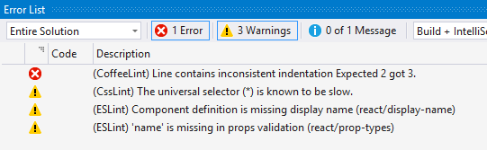
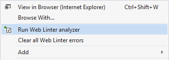
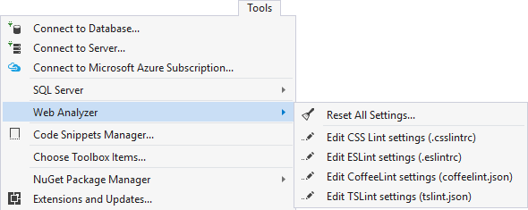

## Web Linter

A Visual Studio extension that runs ESLint and TSLint on JavaScript and
TypeScript files

Download the extension at the
[VS Gallery](https://visualstudiogallery.msdn.microsoft.com/6edc26d4-47d8-4987-82ee-7c820d79be1d)
or get the
[nightly build](http://vsixgallery.com/extension/36bf2130-106e-40f2-89ff-a2bdac6be879/)

See the
[changelog](https://github.com/madskristensen/WebLinter/blob/master/CHANGELOG.md)
for changes and roadmap.

### Features
- Lints JavaScript, JSX, TypeScript, CoffeeScript and CSS files using:
  - [ESLint](http://eslint.org/) (a better version of JSHint, JSLint and JSCS)
  - [CssLint](https://github.com/CSSLint/csslint/wiki)
  - [CoffeeLint](http://www.coffeelint.org/)
  - [TSLint](https://github.com/palantir/tslint)
- Error List integration
- Runs when a file is opened and when the file is saved
- Run on a single file, folder or the entire project
- Configuration files lets you select what rules to run
- Both errors and warnings are supported
- Option to turn off one or more linters

### Error List
When an error is found it will show up in the Error List in
Visual Studio as either an error or a warning.

The individual rules for each linter can be configured to be
either an error or a warning.

Double-clicking an error will open the file and place the
cursor at the location of the error.

### Run the linters
The linters automatically run when you open a supported file.
That makes it easy to see if there are any errors.

When saving the file the linter runs again.

You can manually run the linters on a single file, multiple files,
folders or the entire project by right-clicking in Solution
Explorer.

It's also from the same context menu you can clear all the
errors generated by Web Linters.

### Configuration
Each linter has their own configuration file. For instance,
**ESLint** uses a JSON file with the name of `.eslintrc` to
store the configuration in.

The configuration files are located
in your user profile. Example: `C:\Users\myname\`.

It's easy to modify the configuration files by using the
menu commands to open them:

If the configuration files have gotten messed up, you can reset
them to their defaults by clicking the
**Reset Configuration Files** command. It will prompt to ask
if you are sure you want to proceed and, if you click yes,
all the configuration files will be restored to their defaults.